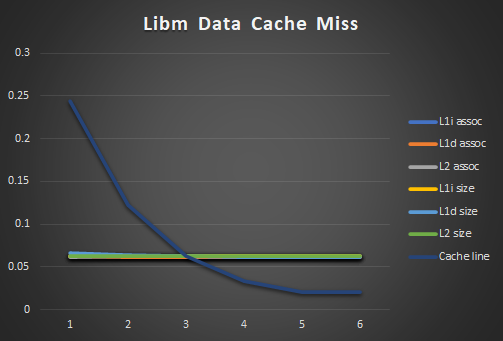
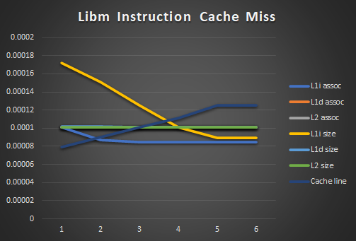
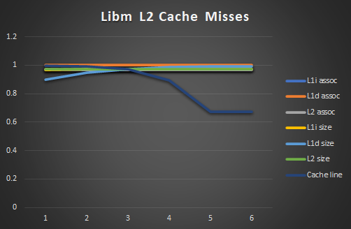
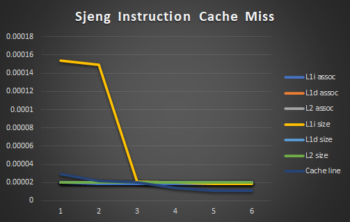
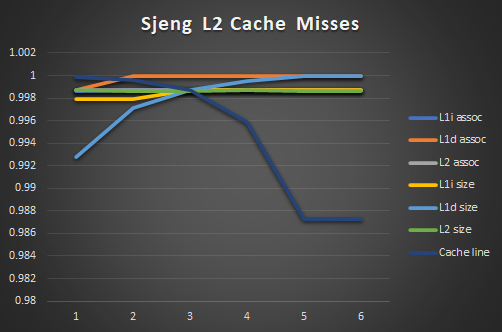

# Lab-2
Computer Architecture Lab 2  
This report was written by Ioannis Diamantaras (9387) and Dimosthenis Mpounarelis (9431).  

## Answer 1:
For the first question we were requested to search through the simulation files and find gem5's default values for our processor's Data Cache size and associativity, Instruction Cache size and associativity, Level 2 Cache size and associativity as well as the cache line size. Since the CPU model used was the same (MinorCPU) across all benchmarks we need only look at one of the files to determine the previous characteristics.
| DCache Size | ICache Size | DCache Associativity | ICache Associativity | L2 Size | L2 Associativity | Cache Line Size |
|-------------|-------------|----------------------|----------------------|---------|------------------|-----------------|
| [65536 B](Results/Default/specbzip/config.ini#L169) | [32768 B](Results/Default/specbzip/config.ini#L833) | [2](Results/Default/specbzip/config.ini#L152) | [2](Results/Default/specbzip/config.ini#L816) | [2097152 B](Results/Default/specbzip/config.ini#L1078) | [8](Results/Default/specbzip/config.ini#L1061) | [64](Results/Default/specbzip/config.ini#L199) |  

We also took note of the execution times, CPI and the various cache miss rates for our benchmarks and compiled the following graphs to help us compare:  

  
  

It is apparent that the chess simulation benchmark (sjeng) has the highest overall CPI and execution time. That is a result of the massive amount of data cache and level 2 misses which probably occur due to the binary tree traversals that happen within the benchmark's code (very low locality). It is followed by libm which has less than half the CPI of sjeng. This model's drawback and the reason for its high CPI is the large amount of instruction cache misses which are most probably the result of the large amount of different and unrelated mathematical operations that need be executed on the data for the program. Benchmarks mcf and bzip are equally quick to run and have a significantly smaller CPI. As a pair they are similar to the pair of sjeng and libm in that bzip's higher than 1 CPI is a result of data cache misses and mcf's CPI derives mainly from instruction cache misses. Something that holds for every benchmark and was also expected before any expirimentation is that its CPI is also greatly dependent on the amount of level 2 misses. The reason for that is that after a level 2 cache miss info has to come directly from the memory whose latency is significantly larger than that of our caches.
  
Finally, we tested for the effects of the system and CPU clocks on the benchmarks. We found out that all CPU cores have the same frequency, which is equal to the value of cpu_cluster.clk_domain.clock. Other than the frequency of the processing units, cpu_cluster.clk_domain.clock also defines the frequency of our L1 and 2 caches. The system.clk_domain.clock defines the frequency of all other components of the simulated machine as well as the communication speed between them. This variable seems to be constant and equal to 1GHz.  
We also tested for the scalability of the benchmarks according to the CPU clock frequency and the results differ between the various benchmarks.    

|       | 1GHz     | 2GHz     | scaling | 
|:-----:|----------|----------|---------|
| BZip  | 0.160361s | 0.083656s | 0.5217  |
| MCF   | 0.123264s | 0.062553s | 0.5075  |
| sjeng | 0.51374s  | 0.51374s  | 0.7282  |
| libm  | 0.000064s | 0.000045s | 0.7031  |

|       | 1GHz     | 3GHz     | scaling |
|:-----:|----------|----------|---------|
| BZip  | 0.160361s | 0.058175s | 0.3628  |
| MCF   | 0.123264s | 0.043017s | 0.349   |
| sjeng | 0.51374s  | 0.449832s | 0.63765 |
| libm  | 0.000064s | 0.000039s | 0.6094  |

It seems that we have the MCF and the BZIP benchmarks have almost perfect scalability, since when we doubled or tripled the frequency of the cpu cluster clock, the number of the simulated seconds got divided by 2 or 3 respectively.
The other two benchmarks do not scale well; it has to do with the fact that these benchmarks have a high L2 cache miss rate and thus even though the CPU has a higher clock , it has to wait for the needed memory chunks to arrive from the L2. 
  
## Answer 2:
For the next step of the exercize we were requested to make an attempt at finding optimal architecture for each benchmark by minimizing the CPI and chache misses. Of course, running haphazard experiments for random values for each and every one of our given variables would take too much time even with the limits we were given. The algorithm we came up to reduce time was the following: We would first check each variable individually to see how large of an effect it has on our execution. Afterwards we ordered each vaible for each program by order of importance and run experiments optimizing one variable each time. That should have been sufficient for us to find the optimum had our variables been completely independent. We are aware however that such a thing is untrue, we consider groups our variables to be lightly dependent, to be more specific each cache should be dependent on the corresponding associativity, also, caches of the same level should also be dependent on eachother's size and cache line size should be correlated with all other variables. Keeping that in mind we executed a few extra experiments to see if that light dependence was enough to through our results off at any point and made any needed corrections. _(Note: If two or more experiments showed the same results for different values of our variables we always kept the lowest variable values to ensure that the cost is also kept to a minimum for the next question)_  

  

  

  

  

  

  

  

  

_(Note: In order to compress the info on the previous graphs we made the X axis represent different things for different variables, specificaly, associativities are 2i-1, L1 sizes are 2i*8kB, L2 sizes are 2i*128kB and cache line sizes are 2i*8)_

It is apparent that all benchmarks benefit from a larger cache size as that reduces the amount of accesses to higher level memory. Depending on the benchmark the balance between L1 data cache size and L1 instruction cache size may differ however they ultimately add up to the maximum possible. The associativities and cache line sizes are a bit more varied. It seems that generally higher values are more benefitial but we found that turning points exist where if the variable is increased above that then the benchmark starts running less efficiently again.  

As mentioned previously we had ordered our variables by order of importance, the following table shows our ordering of the variables a bit more clearly

| Priority | bzip            | mcf             | sjeng           | libm            |
|----------|-----------------|-----------------|-----------------|-----------------|
| 1st      | L2 size         | L2 size         | Cache Line size | Cache Line size |
| 2nd      | L1 data size    | L2 assoc        | L2 size         | L2 size         |
| 3rd      | L1 data assoc   | L1 data assoc   | L1 data size    | L1 data size    |
| 4th      | L2 assoc        | L1 data size    | L1 data assoc   | L1 data assoc   |
| 5th      | L1 inst. size   | L1 inst. size   | L2 assoc        | L2 assoc        |
| 6th      | L1 inst. assoc  | L1 inst.assoc   | L1 inst. size   | L1 inst. size   |
| 7th      | Cache Line size | Cache Line size | L2 inst. assoc  | L1 inst. assoc  |

After our experiments concluded we reached the following "optimal" values for CPI:  
bzip - 1.583797 with  
L2 size 4MB, L1 data size 128kB, L1 instruction size 128kB, L2 associativity 32, L1 data associativity 32, L1 instruction associativity 8, cache line size 256  
  
mcf - 1.109019 with  
L2 size 4MB, L1 data size 64kB, L1 instruction size 128kB, L2 associativity 16, L1 data associativity 32, L1 instruction associativity 16, cache line size 128  
  
sjeng - 3.714661 with  
L2 size 4MB, L1 data size 128kB, L1 instruction size 128kB, L2 associativity 2, L1 data associativity 2, L1 instruction associativity 2, cache line size 256  
  
libm - 1.653658 with  
L2 size 4MB, L1 data size 128kB, L1 instruction size 128kB, L2 associativity 1, L1 data associativity 2, L1 instruction associativity 2, cache line size 256  

## Answer 3:
For the final question in the exercize we needed to look into bibliography and construct our own cost function for our processor. We decided on the following:  
    
We name our variables  
L1 icache associativity = **_ai_**, L1 dcache associativity = **_ad_**, L2 cache associativity = **_b_**, L1 icache size = **_x_**, L1 dcache size = **_y_**, L2 cache size  = **_z_** and memory (DRAM) size = **_m_**.  
We also define three constants: **_f_** = CPU clock frequency **_l1_** = _f*476.8371582*10^-6_, **_mem_** = _5.722045898*10^-6_, **_l2_** = _(1/3.5)*f*(l1-mem) + mem_, **_c_** = a standard amoun that represents the cost of our CPU's ALUs and other function units.  

With all these variables and constants define we have:  
  
**_Cost_** = _l1*\[x*ai + y*ad] + l2*z*b + mem*m + c_
  
_(Our sources for the creation of the cost function: http://www.toves.org/books/cache/, http://igoro.com/archive/gallery-of-processor-cache-effects/)_  
Our decisions when designing the previous function went as follows: Each component of our CPU is seperate to one another and should thus cost the same regardless of any changes to the other components. CPU functional units should have a standard price as we cannot change them in any way in our experiments. Memories should cost more the larger they are and different levels of memory should have a different cost modifier depending on how fast or slow they are. A cache's associativity increases the design complecity and thus should also increase its cost.

With our cost function, considering a 1GHz clock, our "optimum" architectures would cost:  
Cost(bzip) = 14852.51966  
Cost(mcf) = 17561.03931  
Cost(sjeng) = 7571.129914  
Cost(libm) = 6982.564957  
  
While the default architecture (found at the begining of this report) would cost:  
Cost(default) = 6338.016239 

With these costs in mind, and a few others calculated from other experiments we decided the the way to optimize the balance between cost and CPI is to minimize the product of the two (meaning CPI * Cost).

We found that:
Bzip has a better CPI\*Cost for 64kB icache size, 128kB dcache size, 2MB l2 size and associativities 1,1,2 respectively, the total Cost\*CPI is 11347.79 which is considerably better than what our "optimal CPI" architecture would give us even if its CPI was 1.

MCF has a better CPI\*Cost for 64kb icache, 32kB dcache, 256kB l2 cache and associativities 1,1,1, the total CPI\*Coist is 8043.465 which is almost half of the one for our "optimal" CPI.

For these two models, since their CPI was already very low it seems that the cost of our cost function is much more important to minimize that product thus our results are greatly different than what was mentioned earlier.

Sjeng has a better CPI\*Cost for 16kb icache, 16kB dcache, 256kB l2 cache and associativities 1,1,1, the total CPI\*Cost is 23073.987 ,while the "optimal" CPI system we have built has a total CPI\*Cost of 28124.181002611.

Libm has a better CPI\*Cost for 128kb icache, 128kB dcache, 256kB l2 cache and associativities 1,1,1, the total CPI\*Cost is 10591.6336 ,while the "optimal" CPI system we have built has a total CPI\*Cost of 11546.7744.

**_Comments about this project_**:  
First of all,  We have to point that one of our benchmarks(456.hmmer) would not work at all. According to the instructions given by the professors, we simply did not run this partucular benchmark , so this is why the 456.hmmer and its results do not appear anywhere in this report. Secondly, it should be noted that there are small mistakes in the pdf file of the exercise. For instance, the flag "seed" should follow two dashes (--) and not one(-). Moreover , the "hints" given in the same pdf were not very useful; it was impossible for me to find the phrase "cpu_cluster.clk_domain.clock" anywhere in the config.ini or in config.json or in the stats.txt. What we should search for instead was the "system.cpu_clk_domain". I guess this pdf was written for an older version of gem5, but this is just guessing. These were minor problems though compared to what we have gained. We were inclined to believe that "putting everything in the cpu should make it better, faster". And we were proved wrong. In reality what really happens is that when we change , for instance, a rather small L1 cache to a slightly bigger L1 cache, the CPI gets clearly decreased. However, the more we increase the size of the L1 cache size , the less of the effect we notice in CPI. What happens here is the so-called "diminishing returns". This is not a theory though , read from a textbook or taught in a classroom but ,rather, a live experience we had full control of. 
